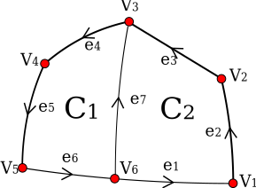

# README

This repository contains a MATLAB collection of objects and methods to analyse
the division plane of plant cells and plant tissues.

## Installation

- Clone or download a copy of this repository
- Add the folder and its subfolders to the MATLAB path

## Cell network

A 2D cell network can be created from a collection of vertices, edges and cells.

Each vertex is a 2D point and a list of vertices can be created as a `nx2`
array.

Each edge is a 2D arc with an optional age (lineage). A list of edges can be
represented as a `nx4` array where each row is composed of the following element:

-   the first element is the index of the starting vertex,
-   the second element is the index of the ending vertex,
-   the third element is the oriented angle (in radians) formed between the arc
    and the chord length joining the 2 vertices. 0 means a straight line,
-   the fourth (optional) element is the age of the edge.

Cells are directed cycles i.e. cyclic sequences of vertices and edges. A list
of cells can be represented as a cell array where is cell contains of vector
with the edge index.

## Example

The following example create a triangular cell:

    % Create a list of 2D vertices
    V=[0 0;
      1 0;
      0 1;];

    % Create a list of edges
    E = [1 2 0;
         2 3 pi/4;
         3 1 0;];

    % Create a cell array of cells
    C = {[1 2 3]};

    % Create the cellNetwork object
    N = cellNetwork(V,E,C);

    % Plot the cellNetwork object
    h = plot(N, 'o-r')
